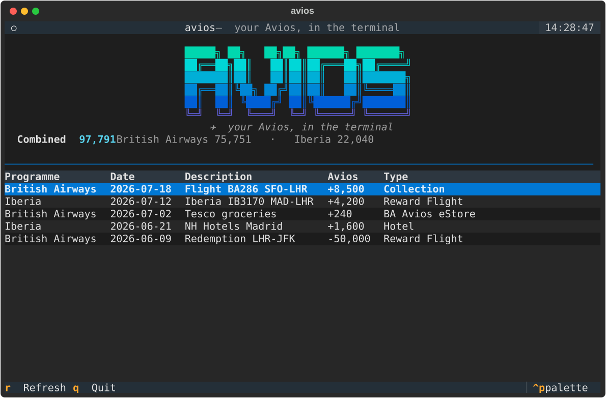

# avios-cli

[](https://github.com/alexechoi/avios-cli/actions/workflows/ci.yml)
[](LICENSE)
[](https://www.python.org/)

A **CLI and TUI for [avios.com](https://www.avios.com)** — check your Avios balance,
browse your transactions and manage your account without leaving the terminal.

> ⚠️ **Unofficial.** This project is not affiliated with, authorised by, or endorsed by
> Avios, British Airways or IAG Loyalty. It drives the same private endpoints the
> avios.com website uses, with your own logged-in session. Use at your own risk; it may
> break at any time and may be against the provider's terms of service.



<sub>The <code>avios tui</code> dashboard (demo data). Regenerate with <code>uv run python scripts/screenshot.py</code>.</sub>

## Status

Early alpha, built in the open. See the [roadmap](#roadmap).

## Install

Requires Python 3.10+.

```bash
uvx avios-cli --help     # try it without installing (recommended)
# or install it:
pip install avios-cli
```

Or from source, for development:

```bash
git clone https://github.com/alexechoi/avios-cli
cd avios-cli
uv sync
uv run avios --help
```

## Log in

avios.com has no credential API — login is Auth0 Universal Login behind hCaptcha and
SMS/passkey MFA — so `avios login` rides a real browser session (like `gh`/`aws`
login). Install the login extra once:

```bash
uv sync --extra login          # or: pip install "avios-cli[login]"
uv run playwright install chromium
```

Then either open a browser to log in, or import the cookie from a browser you're
already logged into:

```bash
avios login                    # opens a browser; log in once, cookie is captured
avios login --from-browser     # instead, read the avios.com cookie from Chrome
```

Your session cookie is stored at `~/.config/avios/state.json` (mode `600`). It
expires after ~a day; just run `avios login` again. Run `avios logout` to remove it.

## Usage

```bash
avios balance                  # your Avios balance
avios transactions --limit 20  # recent transactions
avios pending                  # pending Avios
avios accounts                 # linked loyalty accounts
avios overview                 # dashboard summary (raw JSON)
avios whoami                   # your profile (raw JSON)
avios raw /manage-avios/api/user/current   # hit any endpoint directly
```

Add `--json` to `balance`, `transactions`, `pending` or `accounts` for scriptable
output.

## TUI

```bash
avios tui
```

A full-screen dashboard: your balance in the header and a scrollable transactions
table. Press `r` to refresh, `q` to quit.

## Roadmap

- [x] Project scaffolding, packaging and CI
- [x] Session + cookie storage layer
- [x] Typed API client (balance, transactions, accounts, profile)
- [x] Browser-assisted `avios login`
- [x] CLI commands
- [x] Textual TUI dashboard
- [ ] Reward-flight **availability** search _(coming soon — needs a British Airways capture)_

## Development

```bash
uv sync            # installs the project + the `dev` dependency-group
uv run ruff check .
uv run mypy src
uv run pytest
```

See [CONTRIBUTING.md](CONTRIBUTING.md) for the full workflow and
[CHANGELOG.md](CHANGELOG.md) for release notes.

## Security

No passwords are handled or stored — only your session cookie, kept locally at
`~/.config/avios/state.json` (mode `600`). See [SECURITY.md](SECURITY.md).

## License

[MIT](LICENSE)
